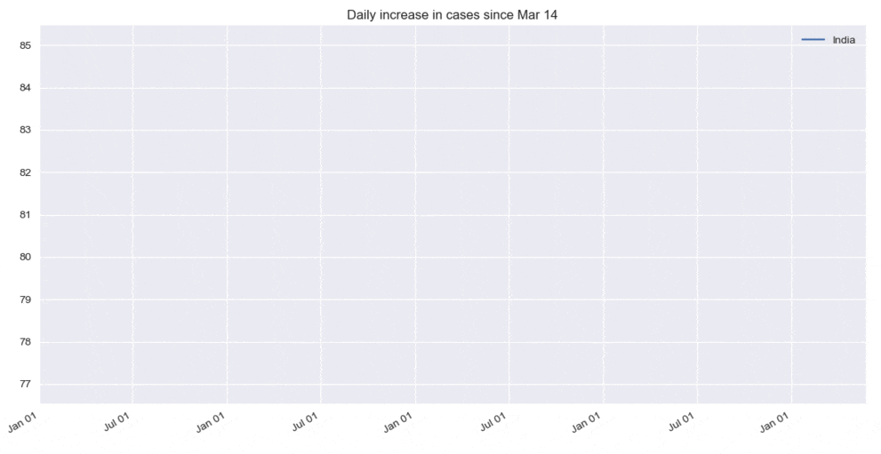

# Covid19 TimeLapse (India)
 Provides an easy to use TimeLapse graph to view the growth in number of Covid19 cases in India (Both daily and cumulative)


## Requirements
1. Python(3 or above)
2. Matplotlib(Can be installed by `pip install matplotlib`)
3. Requests(Can be installed by `pip install requests`)

## How to run

To generate a graph for India, run the program by typing

```
python Main.py
```

To generate a graph for a particular state, run the program by typing

```
python Main.py STATECODE1 STATECODE2 ...
```

Note: Maximum 10 states can be plotted

After that, follow the on screen Instructions

The following are the StateCodes -

| Code      | State |
| ----------- | ----------- |
| AN | Andaman and Nicobar Islands |
| AP | Andhra Pradesh
| AR | Arunachal Pradesh |
| AS | Assam |
| BR | Bihar |
| CH | Chandigarh |
| CT | Chhattisgarh |
| DD | Daman and Diu |
| DL | Delhi |
| DN | Dadra and Nagar Haveli |
| GA | Goa |
| GJ | Gujarat |
| HP | Himachal Pradesh |
| HR | Haryana |
| JH | Jharkhand |
| LA | Ladakh |
| KA | Karnataka |
| KL | Kerala |
| LD | Lakshadweep |
| MH | Maharashtra |
| ML | Meghalaya |
| MN | Manipur |
| MP | Madhya Pradesh |
| MZ | Mizoram |
| NL | Nagaland |
| OR | Odisha |
| PB | Punjab |
| PY | Puducherry |
| RJ | Rajasthan |
| SK | Sikkim |
| TG | Telangana |
| TN | Tamil Nadu |
| TR | Tripura |
| UP | Uttar Pradesh |
| UT | Uttarakhand |
| WB | West Bengal |
| JK | Jammu and Kashmir |
| TT | India |

## Source

Our data is collected from [Covid19India](https://github.com/covid19india/covid19india-react).
